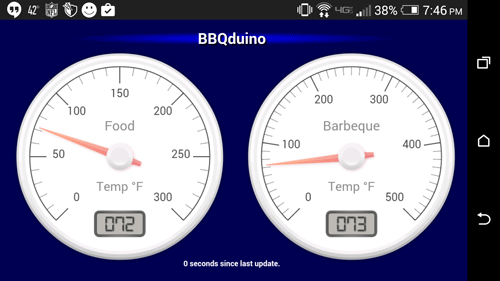
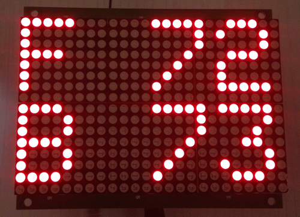

# Yet Another BBQduino!

## What does this BBQduino do?

- Captures and decodes the transmissions from a Maverick ET-732 Remote BBQ Smoker Thermometer
  - Also verified to work with Ivation Long Range Wireless Digital Thermometer model IVA-WLTHERM
- Provides the temperature information (in Celcius or Fahrenheit) on:
  - Webpage
  - Adafruit 16x24 Red LED Matrix Panel - Chainable HT1632C Driver

## What is needed to build this?

- Arduino Ethernet Board OR Arduino Uno + Ethernet shield
- Adafruit 16x32 Chainable LED Matrix Panel
- 433MHz Superheterodyne Receiver
- Protyping shield or a custom PCB (forthcoming)
- Micro SD card
- 9V, 1A power supply with 2.1mm plug

## How to build:

- The .ino file documents the needed connections:
	-  The datapin of the 433MHz receiver MUST be connected to pin 8 on the Arduino.
	- It is recommended that you use a 35cm antenna with your receiver.
    - 3 pins are needed to provide the signals to the LED panel.  The .ino file uses A1, A2, and A3.
    - The Adafruit tutorial for the LED panel additional information for connecting the panel.  HOWEVER, there is no need to download the Adafruit library for the LED panel as this repository includes all needed files for this project.
- Modify the IP address of the webserver in the .ino file.
- Ensure that the MAC address is unique for your network.

  